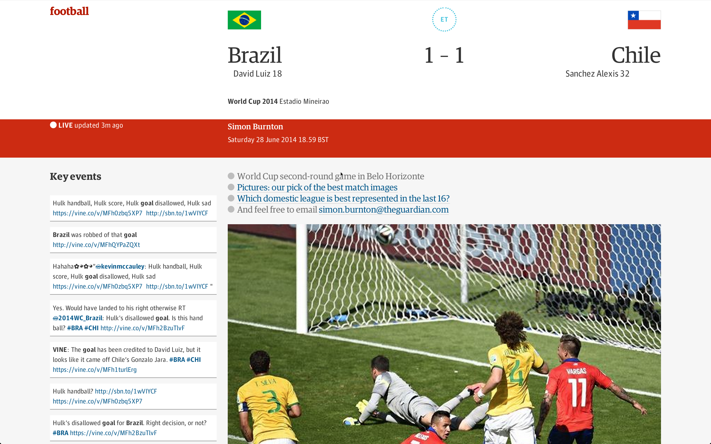

This Chrome extension adds a live goal [Vine](https://vine.co/) feed to The Guardian's World Cup live blogs.

The feed refreshes every 60 seconds.

To install download the code, go to chrome://extensions/ in Chrome, turn on 'developer mode' and load the application using the 'load unpacked extension'.

Pull requests welcome!

_This is **not** endorsed by The Guardian or FIFA. All video content is uploaded and hosted by third parties._
